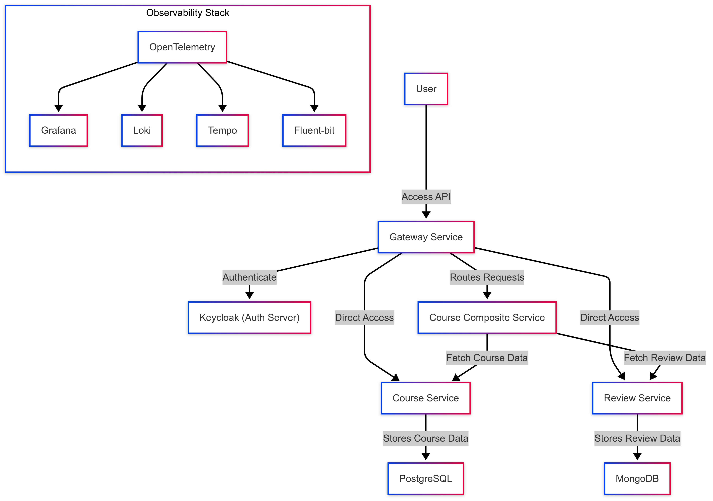
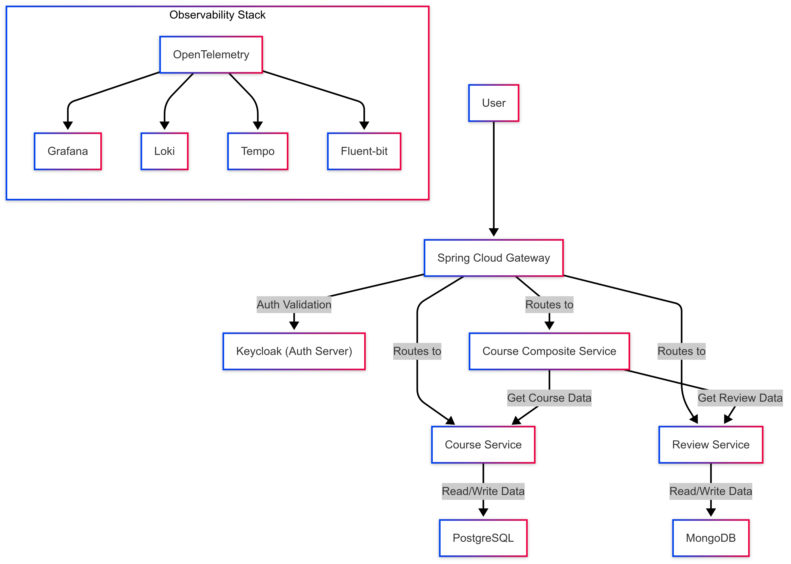
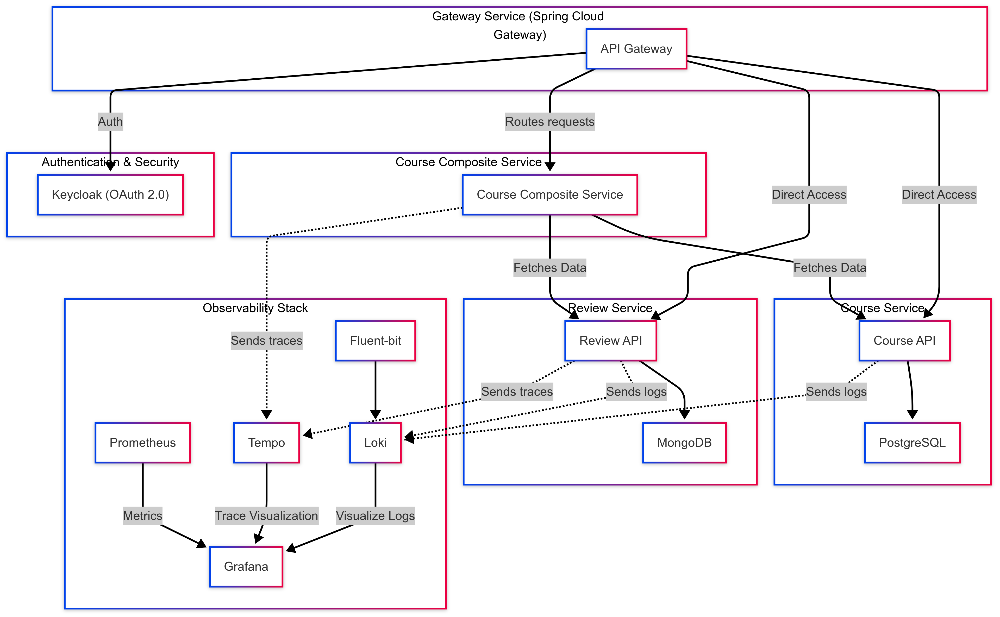

# SpringScholar Hub
A comprehensive, production-ready microservices architecture designed for managing courses and user reviews. This repository demonstrates modern cloud-native patterns with a heavy emphasis on:

- Centralized API routing via an edge gateway.

- Robust Identity and Access Management (OAuth2/OIDC) powered by Keycloak.

- Full-spectrum observability, including distributed tracing, centralized logging, and metrics.

Seamless local development and deployment workflows leveraging Docker Compose and Kubernetes via Tilt.
---

## Table of Contents

- [Overview](#overview)
- [Architecture](#architecture)
- [Tech Stack](#tech-stack)
- [Prerequisites](#prerequisites)
- [Quick Start (Docker Compose)](#quick-start-docker-compose)
- [Run with Kubernetes + Tilt](#run-with-kubernetes--tilt)
- [Core Endpoints](#core-endpoints)
- [Keycloak](#keycloak)
- [Observability](#observability)
- [Troubleshooting](#troubleshooting)

---

## Overview

This system is logically partitioned into core business domains and foundational platform infrastructure to ensure scalable, maintainable code:

**Gateway Service**: Acts as the system's front door, handling dynamic request routing and edge-level security.

**Course Service:** A relational domain service responsible for the course catalog, backed by PostgreSQL.

**Review Service:** A high-throughput NoSQL domain service managing user feedback, backed by MongoDB.

**Course Composite Service:** An aggregator pattern implementation that stitches together discrete data from both the Course and Review services for streamlined client consumption.

**Keycloak:** The dedicated identity provider handling authentication and authorization across the cluster.

**Observability Stack:** A complete telemetry ecosystem featuring Prometheus, Grafana, Loki, Tempo, Fluent Bit, and the OpenTelemetry (OTEL) Collector.
---

## Architecture

### Context Diagram


### Container Diagram


### Component Diagram


### Deployment View


---

## Tech Stack

- **Java 17**, **Spring Boot**, **Spring Cloud Gateway**
- **PostgreSQL** (Course Service)
- **MongoDB** (Review Service)
- **Keycloak** (OAuth2/OIDC)
- **OpenTelemetry**, **Prometheus**, **Grafana**, **Loki**, **Tempo**, **Fluent Bit**
- **Docker Compose** and **Kubernetes (AWS EKS)**

---

## Prerequisites

Install the following before running:

- Java 17+
- Maven 3.8+
- Docker + Docker Compose
- curl or HTTPie for API validation

---

## Quick Start (Docker Compose)

> Make sure Docker Engine is running.

### 1) Start databases

```bash
cd docker
docker compose -f docker-compose-infra.yml up --build
```

### 2) Start observability stack

```bash
cd docker
docker compose -f docker-compose-observability.yml up --build
```

### 3) Start microservices

From repository root:

```bash
sh run.sh docker
```

or

```bash
sh run.sh
```

---

##Run with Kubernetes + Tilt (Amazon EKS)
This workflow assumes you have an active AWS account, the AWS CLI configured, and the eksctl tool installed.

**1) Create an EKS Cluster**
Use eksctl to spin up a new cluster. This process takes approximately 15-20 minutes.

```Bash
eksctl create cluster \
  --name microservice-cluster \
  --region us-east-1 \
  --nodegroup-name standard-workers \
  --node-type t3.large \
  --nodes 2 \
  --nodes-min 1 \
  --nodes-max 3 \
  --managed
```
Note: Adjust the --region and --node-type based on your requirements and AWS limits.

**2) Verify Cluster Access**
Ensure your local kubectl context is configured correctly and pointing to your new EKS cluster.

```Bash
aws eks update-kubeconfig --region us-east-1 --name microservice-cluster
kubectl get nodes
```

**3) Set Up an Ingress Controller**
EKS does not have a built-in ingress addon like Minikube. We recommend installing the NGINX Ingress Controller.

```Bash
kubectl apply -f https://raw.githubusercontent.com/kubernetes/ingress-nginx/controller-v1.8.2/deploy/static/provider/aws/deploy.yaml
```
Wait for the AWS Classic Load Balancer to provision:

```Bash
kubectl get svc -n ingress-nginx ingress-nginx-controller
```
(Copy the EXTERNAL-IP—this is the base URL for routing traffic to your cluster).

**4) Build and Push Images to a Container Registry**
Because EKS runs in the cloud, it cannot access your local Docker daemon. You must push your images to a registry like Amazon ECR or Docker Hub.

First, update build-images.sh to tag images with your registry URI (e.g., <aws_account_id>[.dkr.ecr.us-east-1.amazonaws.com/service-name:latest](https://.dkr.ecr.us-east-1.amazonaws.com/service-name:latest)).

**Log in to ECR** 
``` bash
aws ecr get-login-password --region us-east-1 | docker login --username AWS --password-stdin <aws_account_id>.dkr.ecr.us-east-1.amazonaws.com
```
**Build and push images**
``` bash
sh build-images.sh
```
**5) Start Platform with Tilt**
Note: You must update your Kubernetes manifests in the project to point to the remote registry URIs instead of local image names.

```Bash
tilt up
```
Optional check:

```Bash
tilt get uiresources
```
Each service exposes actuator metrics and Prometheus output.

**Core Endpoints**
Note: When using EKS, your endpoints will be accessible via the External IP (or DNS name) of the NGINX Ingress Controller provisioned in Step 3.

Typical routes exposed through the gateway:

GET http://<INGRESS_EXTERNAL_IP>/course

POST http://<INGRESS_EXTERNAL_IP>/course

GET http://<INGRESS_EXTERNAL_IP>/review

POST http://<INGRESS_EXTERNAL_IP>/review

GET http://<INGRESS_EXTERNAL_IP>/course-composite/{courseId}

Actuator/metrics examples:

GET http://<INGRESS_EXTERNAL_IP>/actuator/health

---

## Keycloak

Keycloak is used as the identity provider for user authentication and token issuance.

Typical local flow:

1. Open Keycloak admin/UI.
2. Ensure realm, clients, and users are configured.
3. Get a bearer token from Keycloak.
4. Call gateway APIs with `Authorization: Bearer <token>`.

The token must contain both:

## Observability

### Prometheus
- Check service targets are **UP**.
- Scrape metrics from `/actuator/prometheus`.

### Grafana
- Use dashboards for metrics/logs/traces correlation.

### Fluent Bit + Loki
- Fluent Bit forwards service logs to Loki.

### Tempo + OpenTelemetry
- Services export traces through OTel collector to Tempo.

---

## Troubleshooting

- **Services fail to start**: verify dependent containers (PostgreSQL, MongoDB, Keycloak) are healthy.
- **Auth issues (401/403)**: check token expiration, client config, and realm roles in Keycloak.
- **No logs/traces/metrics**: ensure Fluent Bit, OTel collector, Prometheus, Loki, and Tempo are running.
- **Kubernetes image pull issues**: confirm you built images in ECS Docker context (`docker-env`).

---


